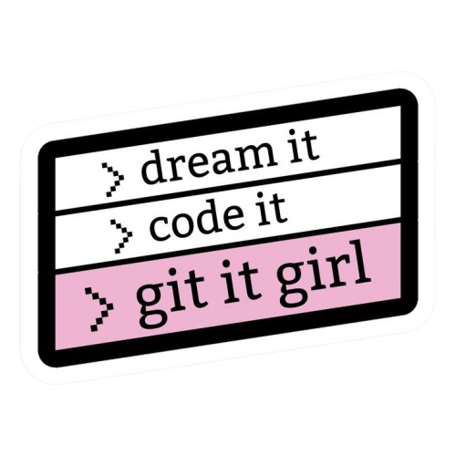

## Hi there 👋

###

###

<!---

###
--->

I’m a Data Scientist passionate about machine learning, AI, and building cool data-driven products.

✨ This is my little corner of the tech world where I document my journey as a data scientist. I’m endlessly curious and love exploring new tools, ideas, and technologies—
constantly learning, building, and sharing along the way.

### let's connect:

  
  

<!--

  
  

--->

## 🛠️ some tools I like to use
<!---->

  

  

  

##  
###

  

###

<!---
 
--->
🔭 I’m currently working on building a resume Q&A app using vector search and LLMs. [Ask](https://ask-my-resume.up.railway.app) me about my resume....or [build](https://github.com/nmkhan096/ask-my-resume-rag) to ask yours!

<!--

<!---<h2 align="left">Hi 👋! My name is ... and I'm a ..., from ....</h2>-->

<!---
###

###

  
  
  
  
  
  
  
  
  
  
  
  
  

 

###

<!--
**nmkhan096/nmkhan096** is a ✨ _special_ ✨ repository because its `README.md` (this file) appears on your GitHub profile.

Here are some ideas to get you started:

- 🔭 I’m currently working on ...building a resume Q&A app using vector search and LLMs. Ask me about my resume [here](https://ask-my-resume.up.railway.app)... or [build](https://github.com/nmkhan096/ask-my-resume-rag) to ask yours
- 🌱 I’m currently learning ...
- 👯 I’m looking to collaborate on ...
- 🤔 I’m looking for help with ...
- 💬 Ask me about ...
- 📫 How to reach me: ...
- 😄 Pronouns: ...
- ⚡ Fun fact: ...
-->
